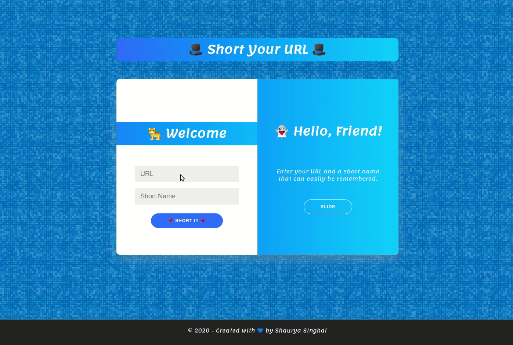

## :octocat: urlShortner ([visit](https://little.now.sh))

    

Yet another shortner !

```
Full stack Url Shortner with tech stack :
(M)ongo
(E)xpress
(N)ode
 + now
```

### Peek a boo!



### User Guide

```
    1. visit https://little.now.sh
    2. create a shorten-URL
    3. visit https://little.now.sh/s/{nameUProvided}
    4. Simple!
```

### Developer Guide

```
    npm run dev
    visit localhost:8081 to test the app
```

### API EndPoints

| Http Method | Endpoint      |
| ----------- | ------------- |
| POST        | /api/shortit  |
| GET         | /s/:shortName |
| GET         | /             |
| GET         | /(\*)         |

##### /api/shortit (POST)

```javascript
{
    url: "https://www.google.com",
    name: "go"
}
```

##### /s/:shortname (GET)

```javascript
redirect(url);
```

##### / (GET)

```javascript
render("index.hbs");
```

##### /(\*) (GET)

```javascript
redirect("/");
```

### Followed Steps

```
- npm init
- npm install express( Fast, unopinionated, minimalist web framework for node).
- npm install morgan(HTTP request logger middleware for node.js)
- npm install mongodb(for Non-relational DB)
- Building an Express App
- serving a html page from public folder for form inputs
    - long URL
    - shortname
- calling backend to take the form-data , validating data, returning data/error
- adding mongo as db  and mongodb as driver and while deploying used mongodb.com for data storage
- setting connection for Database
- made an api for serving data inside mapped_urls.js
- make a connection to db
- use collection to figure out if mapping exist or not
    - if exist throw error
    - else add a new entry to database
```

### Database Creation for testing

```
$ use dbname
    create a db in mongodb
$ db.createCollection('mapped_urls')
    created a collection, Output : { "ok" : 1 }
```

### Deployment with Zeit's now

```
1. Add a now.json File (Phew! that was more work!!)
2. now secrets add <secret-name> <secret-value>
3. $ now -e MONGODB_URL=@mysql-secret
4. now alias ___ little.now.sh
```
